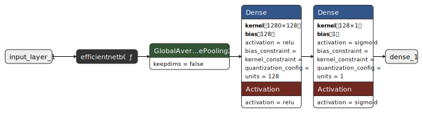

# Análise Comparativa de Arquiteturas de CNNs Pré-Treinadas para Detecção de Pneumonia em Radiografias Torácicas

## Sobre o projeto

Trabalho de Conclusão de Curso em Engenharia da Computação (FMU, 2026).

Análise comparativa de modelos pré-treinados (ResNet50, DenseNet121 e EfficientNetB0) aplicados à classificação de radiografias torácicas para detecção de pneumonia, avaliando estratégias de pré-processamento, treinamento e limiar de decisão. O estudo adota a modalidade de extração de características (_feature extraction_) do Aprendizado por Transferência (_Transfer Learning_), mantendo o modelo base congelado e treinando apenas as camadas superiores.

**Dataset:** [Chest X-Ray Images (Kermany et al., 2018)](https://data.mendeley.com/datasets/rscbjbr9sj/2)  
**Repositório de dados e modelos:** [DagsHub](https://dagshub.com/amartinsmg/classification-of-medical-images-using-cnn)

---

## Tecnologias utilizadas


---

## Estrutura do projeto

```text
├── notebooks/
│   ├── analyses/                 ← comparações experimentais por fase
│   │   ├── 00_base_model.ipynb
│   │   ├── 01_normalization.ipynb
│   │   ├── 02_data_aug.ipynb
│   │   ├── 03_class_weight.ipynb
│   │   ├── 04_data_aug_class_weight.ipynb
│   │   ├── 05_learning_rate.ipynb
│   │   ├── 06_optimal_threshold.ipynb
│   │   ├── 07_baseline_vs_final.ipynb
│   │   └── 08_final_model.ipynb
│   ├── exploratory/              ← análise exploratória e protótipos do pipeline
│   │   ├── 00_data_augmentation_demo.ipynb
│   │   ├── 01_preprocessing_demo.ipynb
│   │   ├── 02_training_prototype.ipynb
│   │   ├── 03_testing_prototype.ipynb
│   │   ├── 04_colab_environment_test.ipynb
│   │   └── 05_aggregate_metrics_test.ipynb
│   └── experiment_runner.ipynb   ← executor dos experimentos no Google Colab
├── schema/
│   └── schema.sql                ← schema do banco de dados SQLite
├── src/
│   ├── analyses.py               ← carregamento, agregação e visualização dos resultados
│   ├── db.py                     ← persistência dos resultados no banco de dados
│   ├── test.py                   ← pipeline de teste e avaliação
│   ├── train.py                  ← pipeline de treinamento
│   └── utils.py                  ← cálculo do threshold ótimo pelo índice de Youden
└── requirements.txt
```

---

## Metodologia experimental

### Arquiteturas avaliadas

Foram escolhidas as seguintes versões de arquiteturas amplamente consolidadas na literatura:

| Identificador  | Arquitetura    | Parâmetros (base) | Tamanho do modelo |
| -------------- | -------------- | ----------------- | ----------------- |
| `resnet`       | ResNet50       | ~25M              | ~90MB             |
| `densenet`     | DenseNet121    | ~8M               | ~30MB             |
| `efficientnet` | EfficientNetB0 | ~5M               | ~20MB             |

As três versões foram escolhidas por terem complexidade computacional comparável, resolução de entrada padrão de 224×224 pixels e por utilizarem _Global Average Pooling_ (GAP) antes da camada de classificação final.

### Construção dos modelos

Todos os modelos seguem o esquema abaixo: modelo base congelado (f), seguido de _pooling_ global e duas camadas densas para classificação binária. Os shapes do kernel da primeira camada densa refletem a dimensionalidade da saída de cada modelo base: 2048 para ResNet50, 1024 para DenseNet121 e 1280 para EfficientNetB0.



### Parâmetros fixos

Os seguintes parâmetros foram mantidos constantes ao longo de todos os experimentos:

- Tamanho do lote (_batch_): 32 imagens
- Resolução de entrada: 224×224 pixels
- Rótulos binários: `0` para normal, `1` para pneumonia
- Embaralhamento do conjunto de treino (apenas)
- Congelamento total das camadas do modelo base
- Otimizador: Adam
- Número de épocas: 10

### Variáveis avaliadas

As seguintes características foram alteradas sequencialmente, com uma análise eliminatória por fase:

| Fase | Notebook                   | Variável                                 |
| ---- | -------------------------- | ---------------------------------------- |
| 00   | `00_base_model`            | Arquitetura base (baseline)              |
| 01   | `01_normalization`         | Estratégia de normalização               |
| 02   | `02_data_aug`              | _Data augmentation_                      |
| 03   | `03_class_weight`          | Balanceamento de classes                 |
| 04   | `04_data_aug_class_weight` | Combinação data aug + class weight       |
| 05   | `05_learning_rate`         | Taxa de aprendizagem do Adam             |
| 06   | `06_optimal_threshold`     | Limiar de decisão (índice de Youden)     |
| 07   | `07_baseline_vs_final`     | Comparação baseline × configuração final |
| 08   | `08_final_model`           | Comparação final entre arquiteturas      |

Cada experimento foi executado em **3 runs independentes** com seeds diferentes (`42`, `123`, `999`), e os resultados são reportados como **média ± desvio padrão** entre as runs.

---

## Como executar

### Pré-requisitos

```bash
pip install -r requirements.txt
```

### Reproduzindo os experimentos no Google Colab

1. Faça um fork do repositório
2. Abra o `experiment_runner.ipynb` no Google Colab
3. Configure os parâmetros do experimento na célula de configuração
4. Execute as células sequencialmente

Os dados de treinamento (dataset de Kermany) devem estar disponíveis no Google Drive. Os resultados são salvos automaticamente no Drive e enviados ao DagsHub ao final de cada experimento.

> **Nota sobre reprodutibilidade:** os uploads ao DagsHub estão configurados para o repositório original. Para reproduzir em conta própria, crie um repositório no [DagsHub](https://dagshub.com), adicione seu token como Secret do Colab (`DAGSHUB_TOKEN`) e atualize a variável `DAGSHUB_REPO` no `experiment_runner.ipynb`.

### Reproduzindo as análises

Os notebooks de análise em `notebooks/analysis/` podem ser executados localmente ou no Colab após clonar o repositório e fazer o pull dos dados via DVC:

```bash
dvc pull results comparisons
```

---

## Resultados

Os resultados completos de todos os experimentos estão disponíveis em dois repositórios:

- **DagsHub** — métricas por run, históricos de treinamento, gráficos comparativos e modelos finais (versionados com DVC):  
  https://dagshub.com/amartinsmg/classification-of-medical-images-using-cnn

- **Zenodo** — snapshot arquivado do dataset de resultados com DOI permanente para citação:  
  https://doi.org/10.5281/zenodo.20149272

---

## Referência

KERMANY, D. S. et al. **Labeled Optical Coherence Tomography (OCT) and Chest X-Ray Images for Classification**. Mendeley Data, v. 2, jun. 2018. Disponível em: https://data.mendeley.com/datasets/rscbjbr9sj/2.
